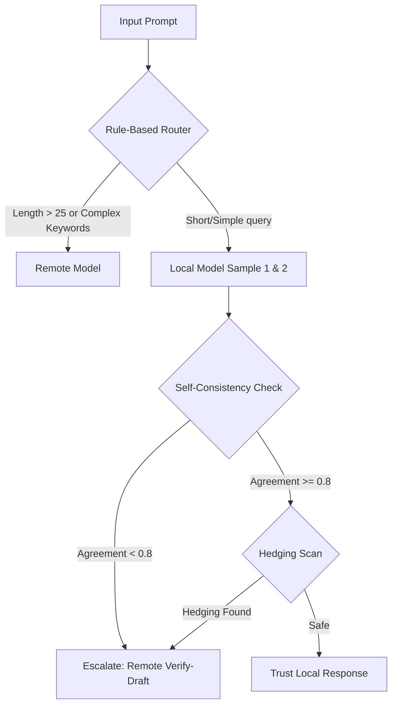

# Hybrid Token-Efficient Routing Agent

This project is a CLI-based hybrid LLM routing agent that dynamically routes user prompts to either a **local model** (free, running locally via Ollama) or a **remote model** (paying tokens, called via Fireworks AI). It optimizes for high accuracy while minimizing the cost of remote completion tokens.

## How It Works



1. **Rule-Based Routing**: Fast checks on length (word count > 25) and coding/math/synthesis keywords.
2. **Self-Consistency Check**: Runs the local model twice at temperature 0.7. If the answers differ too much (similarity < 0.8), it escalates.
3. **Hedging Detection**: Scans local answers for expressions of uncertainty (e.g. "I'm not sure", "As an AI..."). If found, it escalates.
4. **verify-draft Escalation**: When escalating, the agent submits the original task *along with the local model's draft* to Fireworks AI, instructing it to verify or correct the draft. This significantly cuts remote completion tokens compared to resolving the task from scratch.

---

## Setup Instructions

### 1. Local Model Setup (Ollama)
1. Download and install **Ollama** from [Ollama's Official Website](https://ollama.com/).
2. Pull the default 3B instruct model in your terminal:
   ```bash
   ollama pull qwen2.5:3b-instruct
   ```

### 2. Remote Model Setup (Fireworks AI)
1. Obtain an API key from [Fireworks AI](https://fireworks.ai/).
2. Create a file named `.env` in the root of this project and add your API key:
   ```text
   FIREWORKS_API_KEY=your_api_key_here
   ```

---

## Usage

### Run on a Single Task
Run the agent CLI with your prompt as arguments:
```bash
python agent.py "What is the capital of France?"
```
Or run the interactive command loop:
```bash
python agent.py
```

### Run Evaluation Harness
Test the agent against the 10 evaluation tasks in `sample_tasks.json`:
```bash
python eval.py
```

### Run Threshold Sweep
Find the best confidence (self-consistency) threshold that yields maximum accuracy at minimal token cost:
```bash
python eval.py --sweep
```

---

## Hackathon Launch Day Checklist

When the real tasks and scoring models are revealed, update the following:

- [ ] **Local Model**: Adjust the model string in `agent.py` (`model = "qwen2.5:3b-instruct"`) to the specified local model.
- [ ] **Remote Model**: Update the remote model identifier in `agent.py` (`model = "accounts/fireworks/models/llama-v3p1-8b-instruct"`) to the required remote model.
- [ ] **Keyword Rules**: Adapt the keyword list in [router.py](file:///c:/Users/ronak/OneDrive/Desktop/TriForge/router.py) if tasks focus on specific domains.
- [ ] **Evaluation Metric**: Replace the simple keyword/substring matcher in [eval.py](file:///c:/Users/ronak/OneDrive/Desktop/TriForge/eval.py) with the hackathon's official grading script.
